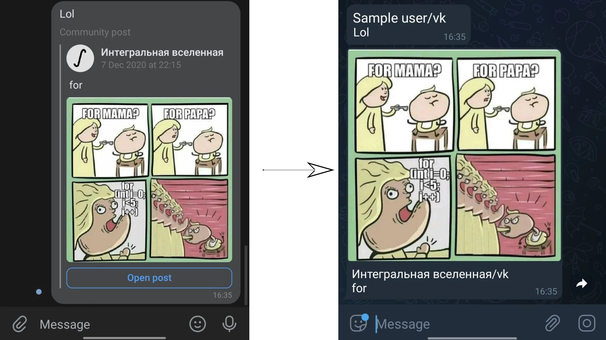

# TransferBot

## Description

A bot for transfering messages from one messenger to another.

Supported attachment types: photos, wall posts, files up to 50 MB  
Supported messengers: VK, Telegram



## Links

- VK bot: [transfer_bot](https://vk.com/transfer_bot)
- Telegram bot: [@content_transfer_bot](https://t.me/content_transfer_bot)

## How to use

- Add the bot (use the links above to find it) to the sender and receiver groups or start a private dialogue with it
- Retrieve a token of the chat from which messages should be transfered by using `/get_token` command
- Subscribe on the channel by using `/subscribe <token>` command in receiving chat
- In case the subscription is no more needed, unsubscribe from a channel using `/unsubscribe <token>`

## Running using Docker Compose

In order for bot to run, you need to specify some environmental variables:
* `TG_TOKEN` - Telegram bot token
* `VK_TOKEN` - VK bot token
* `DB_USERNAME` - database username
* `DB_PASSWORD` - database password
* `CONTROLLER_PORT` - controller service port
* `VK_SERVICE_PORT` - VK service port
* `TG_SERVICE_PORT ` - TG service port

You can also define `MIGRATE_DB` environmental variable in order to run database migrations before starting bot

Environmental variables can be either defined in current shell session or stored in `.env` file in project root.
The rest is handled by Docker Compose, thus your running command may look like this:  
`MIGRATE_DB=1 docker-compose up -d`

In order to shut the bot down you will need to run `docker-compose down`.

## Running without local database

Docker Compose script runs local instance of PostgreSQL server.
One can use Postgres server of his choice instead of one run in local container.
In order to achieve that, one will need to build & run bot with following environmental variables:
* `VK_TOKEN`
* `TG_TOKEN`
* `DB_CONNECT_STRING` - database connection string specifically for selected database

Migrations are managed by [Goose](https://github.com/pressly/Goose), thus one should make use of it to set up database.

## DEBUG

For debugging controller service, the following command may be used:

```shell
docker-compose -f docker-compose.yml -f docker-compose.debug.yml -p transferbot-debug up -d --build
```

Debugger will be available at port 40000 and can be accessed with some interface (e.g. through Goland's remote debugger).
